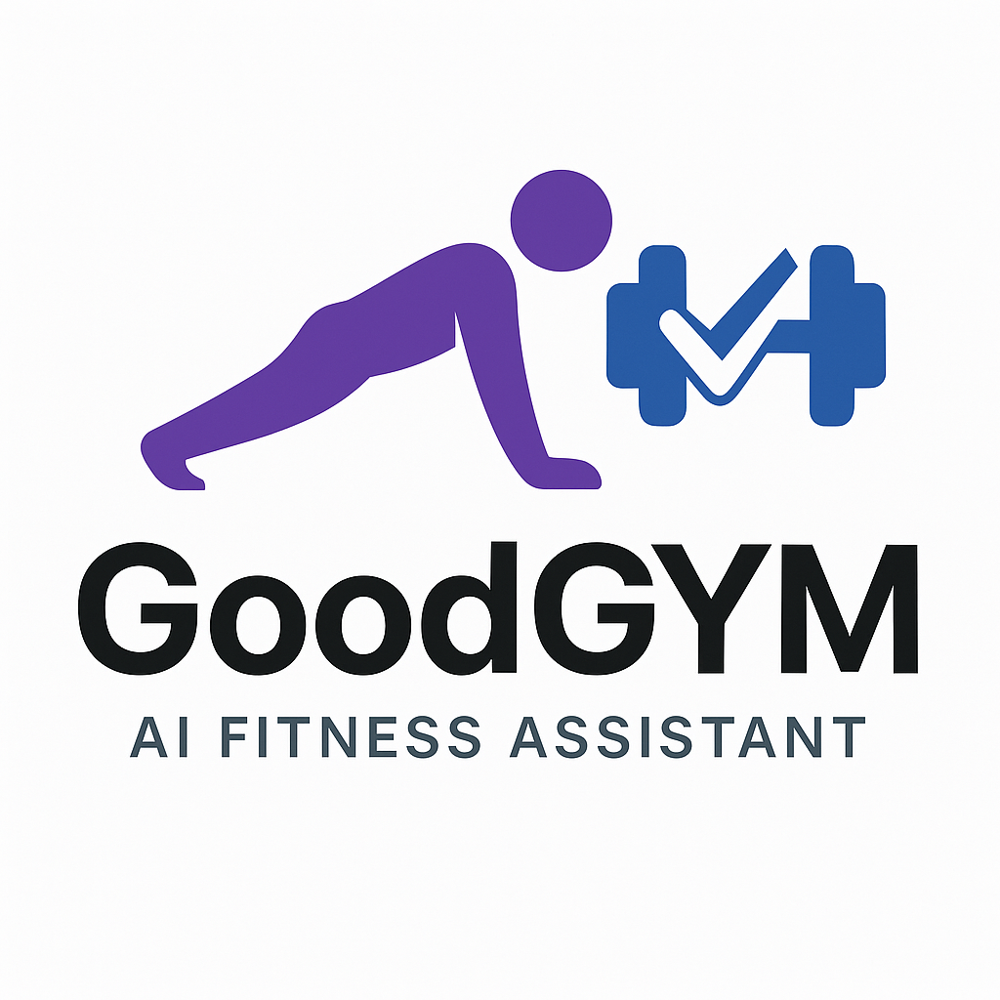
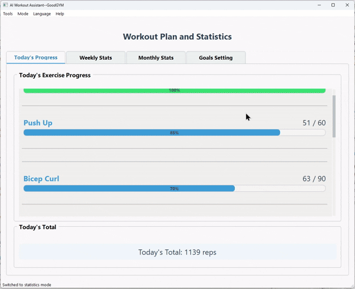
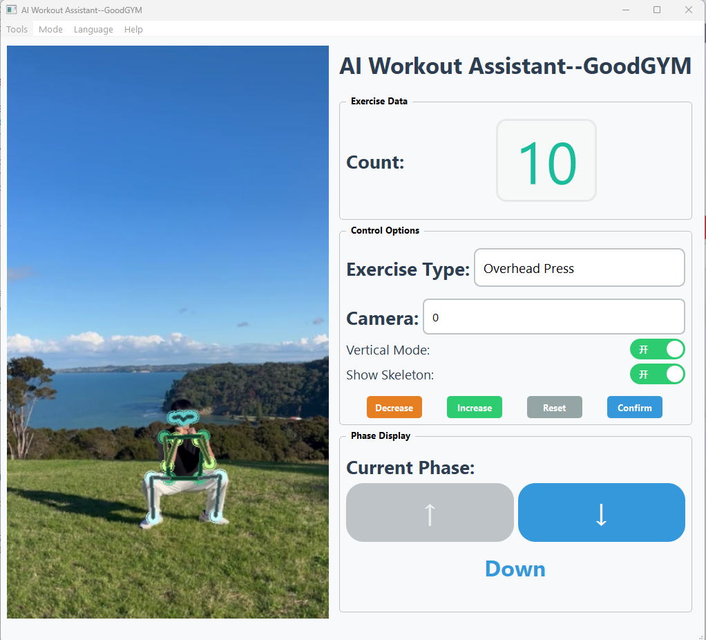
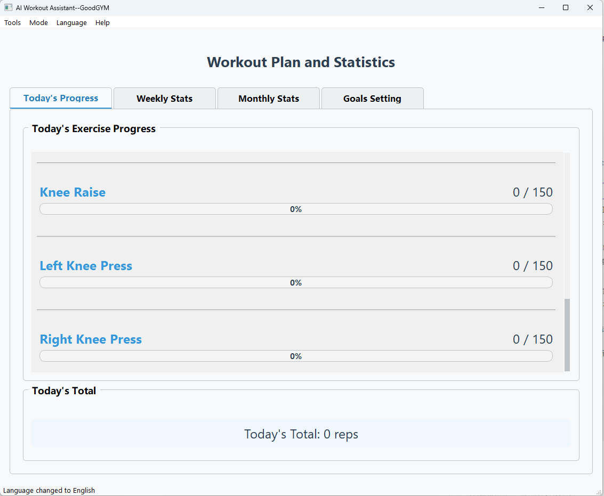
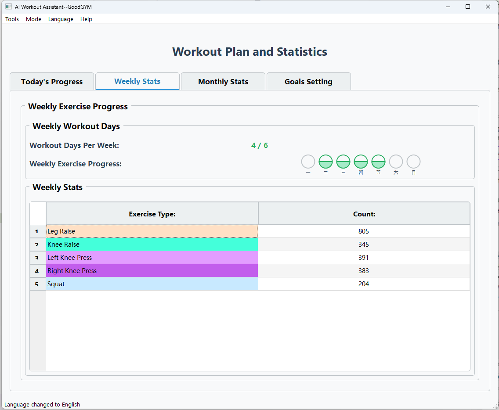
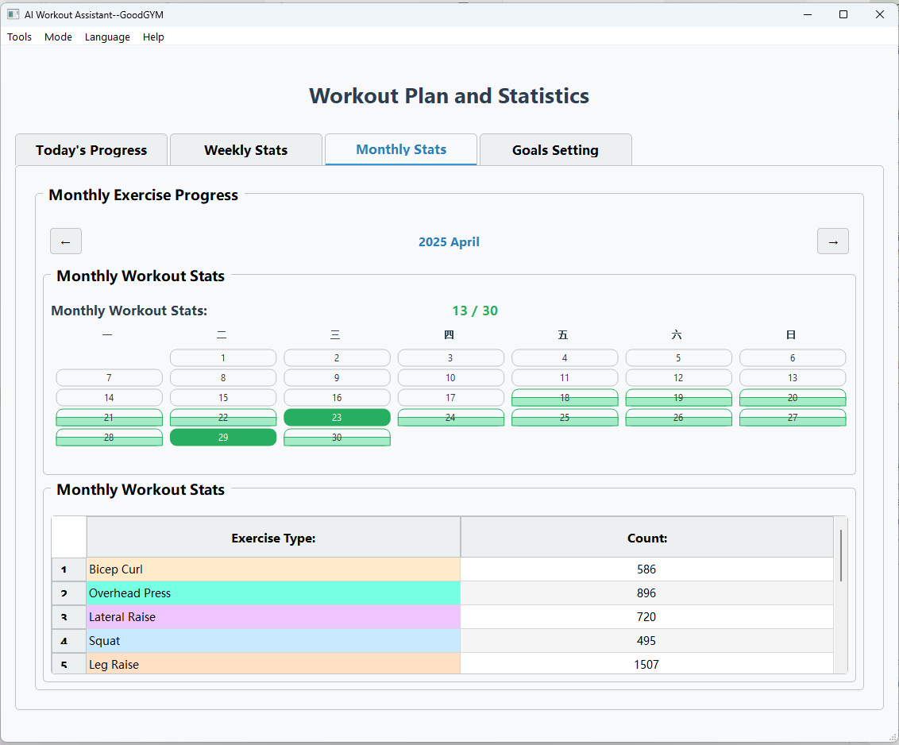
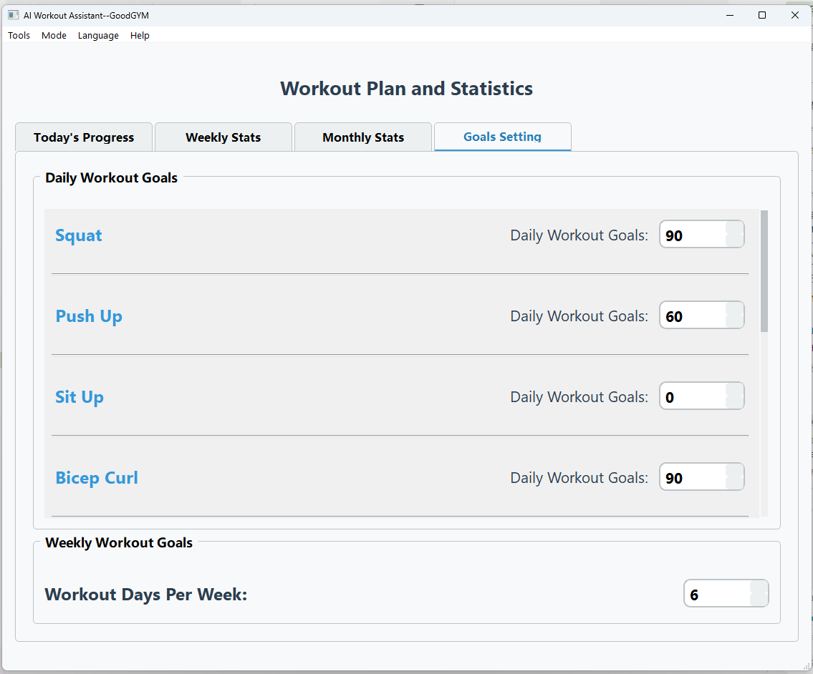

# Good-GYM: AI-Powered Workout Assistant 💪

<div align="center">



[](https://github.com/yo-WASSUP/Good-GYM/stargazers)
[](https://github.com/yo-WASSUP/Good-GYM/network/members)
[](https://github.com/yo-WASSUP/Good-GYM/blob/main/LICENSE)

**Intelligent Fitness Assistant Based on RTMPose**

[English](README.md) | [中文](README_CN.md)

[](https://www.linkedin.com/posts/huihuang-tang_ai-computervision-opencv-activity-7325469166591770624-Bbyx?utm_source=share&utm_medium=member_desktop&rcm=ACoAAD7qaoMBbw89mcxb0dNh_O4ezc8EFShoOtU)

</div>

## 🆕 Changelog

- **2024-06-07**: Major update! Dropped YOLO models and all GPU support. Now uses only RTMPose for pose detection, and runs on CPU only. Simpler, more compatible, and easier to use.


---




## 🌟 Features

- **Real-time Exercise Counting** - Automatically counts your repetitions
- **Multiple Exercise Support** - Including squats, push-ups, sit-ups, bicep curls, and many more
- **Advanced Pose Detection** - Powered by RTMPose for accurate tracking
- **CPU Only** - No GPU required, works on most computers
- **Visual Feedback** - Live skeleton visualization with angle measurements
- **Workout Statistics** - Track your progress over time
- **User-friendly Interface** - Clean PyQt5 GUI with intuitive controls
- **Works with any webcam** - No special hardware required
- **Runs locally** - Complete privacy

## 📦 Direct Download
- If you don't want to set up a Python environment, you can download our pre-packaged executable:

  **Windows EXE package**: 

  [Baidu Netdisk Link](https://pan.baidu.com/s/168Z64JX4iFoIEZom7h8cnA?pwd=8866) code: 8866

  [Google Drive](https://drive.google.com/file/d/1KkNHAu6TAE8QzcyFxLG9K9qmzuRwHJFf/view?usp=drive_link)

  
  **Note**: Windows version requires an NVIDIA GPU and proper drivers to run

## 📝 Usage Guide

### Controls

- Use the interface buttons to select different exercises
- Real-time feedback shows your current form and repetition count
- Press the "Reset" button to reset the counter
- Use manual adjustment buttons to correct the count if needed
- Toggle skeleton visualization on/off
- View your workout statistics over time


## 📋 Requirements

- Python 3.9
- Webcam
- **Windows/Mac/Linux**: CPU only, no GPU required. Performance may vary by hardware.

## 🚀 Environment Setup

### Installation

1. **Clone and install**
   ```bash
   git clone https://github.com/yo-WASSUP/Good-GYM.git
   cd Good-GYM
   
   # Create virtual environment
   python -m venv venv
   # Activate (Windows)
   .\venv\Scripts\activate
   # or (Mac/Linux)
   source venv/bin/activate
   
   # Install dependencies
   pip install -r requirements.txt
   ```

2. **Run the application**
   ```bash
   python workout_qt_modular.py
   ```

## 🖼️ Screenshots











## 🤝 Contributing

Contributions are welcome! Please feel free to submit a Pull Request.

## 📄 License

This project is licensed under the MIT License - see the LICENSE file for details.

## 🔮 Future Development

- [ ] Add support for more exercise types
- [ ] Improve pose detection accuracy
- [ ] Add voice feedback
- [ ] Multi-language interface
