# Good-GYM: AI Fitness Assistant 💪

<div align="center">


[](https://github.com/yo-WASSUP/Good-GYM/stargazers)
[](https://github.com/yo-WASSUP/Good-GYM/network/members)
[](https://github.com/yo-WASSUP/Good-GYM/blob/main/LICENSE)

**AI Fitness Assistant**

[](https://apps.apple.com/cn/app/goodgym/id6761142874?l=en-GB)

[English](README.md) | [中文](README_CN.md)

[](https://www.linkedin.com/posts/huihuang-tang_ai-computervision-opencv-activity-7325469166591770624-Bbyx?utm_source=share&utm_medium=member_desktop&rcm=ACoAAD7qaoMBbw89mcxb0dNh_O4ezc8EFShoOtU)

</div>

## 🆕 Changelog

- **2025-06-07**: Major update! Dropped YOLO models and all GPU support. Now uses only RTMPose for pose detection, and runs on CPU only. Simpler, more compatible, and easier to use.
- **2025-06-12**：Optimize exercise_counters.py for counting accuracy, code structure optimization
- **2025-11-14**: Reverted asynchronous pose detection due to accuracy issues, restored synchronous pose detection. Fixed crash when switching from statistics mode back to detection mode.
- **2025-11-15**: New exercise database feature! All exercise configurations are now managed in `data/exercises.json` file. You can easily add, modify, or remove exercise types without modifying code.
- **2026-03-04**: Add optional GPU acceleration support, now supports NVIDIA GPUs
- **2026-03-28**: Add mobile application support, now supports IOS  

## 🔮 Future Development

- [x] Multi-language interface
- [x] Improve pose detection accuracy
- [x] Add support for more exercise types
- [x] Add custom exercise types template
- [x] Recognizing Motion Accuracy
- [x] Mobile Application Support
- [ ] Motion Error Correction Indication
- [ ] Add voice feedback


---

<div align="center">

### 📱 Try Good-GYM on iOS

<a href="https://apps.apple.com/cn/app/goodgym/id6761142874?l=en-GB">
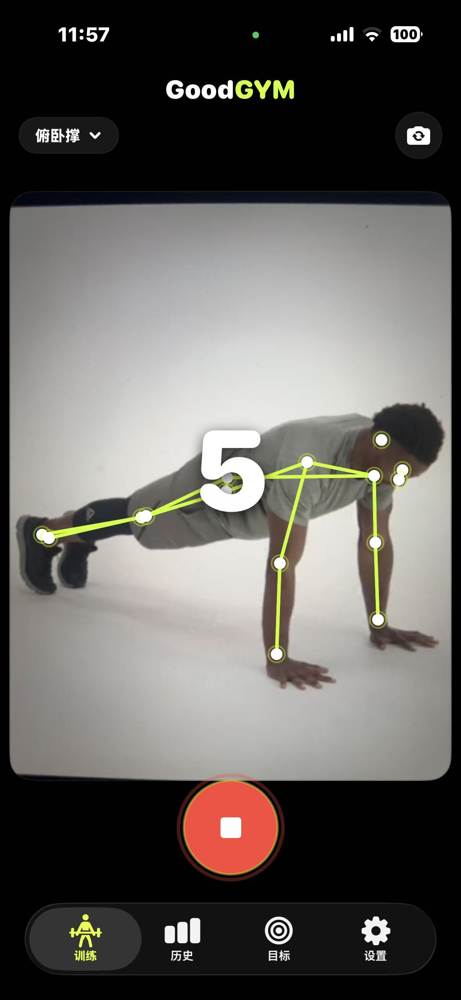
</a>
<a href="https://apps.apple.com/cn/app/goodgym/id6761142874?l=en-GB">

</a>

[](https://apps.apple.com/cn/app/goodgym/id6761142874?l=en-GB)

</div>

---

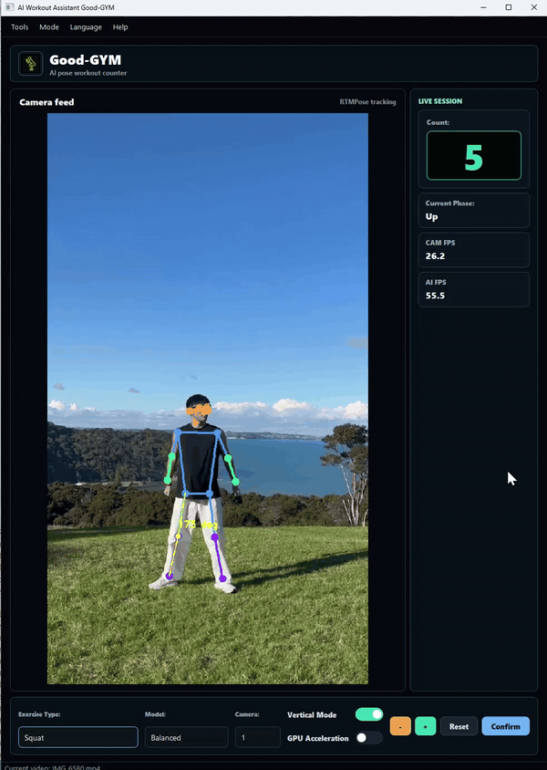

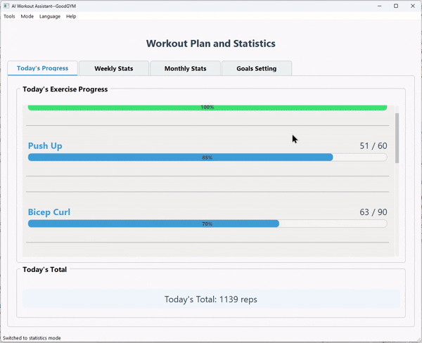

## 🌟 Features

- **Real-time Exercise Counting** - Automatically counts your repetitions
- **Multiple Exercise Support** - Including squats, push-ups, sit-ups, bicep curls, and many more
- **Advanced Pose Detection** - Powered by RTMPose for accurate tracking
- **CPU & GPU Support** - Works on CPU by default, with optional GPU acceleration
- **Visual Feedback** - Live skeleton visualization with angle measurements
- **Workout Statistics** - Track your progress over time
- **User-friendly Interface** - Clean PyQt5 GUI with intuitive controls
- **Works with any webcam** - No special hardware required
- **Runs locally** - Complete privacy

## 📦 Direct Download

### 📱 iOS App

  [](https://apps.apple.com/cn/app/goodgym/id6761142874?l=en-GB)

### 💻 Windows Desktop
- If you don't want to set up a Python environment, you can download our pre-packaged executable:

  [Baidu Netdisk Link](https://pan.baidu.com/s/1xzZjwUmnXLaWatqPcSE1zw) code: 8866

  [Google Drive](https://drive.google.com/file/d/1VKDecEDLdnyi59ZmHhOvUPwAxxkw9wlH/view?usp=drive_link)

## 📝 Usage Guide

### 🎯 Custom Exercise Types

All exercise types are now stored in the `data/exercises.json` file. You can easily add, modify, or remove exercise types without modifying code!

#### How to Add a New Exercise Type

1. **Keypoint Index Reference**
   - The system uses COCO 17 keypoint format:
     ```
                    ○ 0
                   /|\
            1 ●     |     ● 2
           3 ●      |      ● 4
                    |
          5 ●———————————● 6
            |       |       |
            |       |       |
          7 ●       |       ● 8
            |       |       |
            |       |       |
          9 ●       |       ● 10
                    |
         11 ●———————————● 12
            |               |
            |               |
         13 ●               ● 14
            |               |
            |               |
         15 ●               ● 16

      Index │ Keypoint    Index │ Keypoint
      ──────┼──────────  ──────┼──────────
        0   │ Nose          9  │ L.Wrist
        1   │ L.Eye        10  │ R.Wrist
        2   │ R.Eye        11  │ L.Hip
        3   │ L.Ear        12  │ R.Hip
        4   │ R.Ear        13  │ L.Knee
        5   │ L.Shoulder   14  │ R.Knee
        6   │ R.Shoulder   15  │ L.Ankle
        7   │ L.Elbow      16  │ R.Ankle
        8   │ R.Elbow
     ```

2. **Configuration Parameters**
   - `down_angle`: Angle threshold when lowering (degrees)
   - `up_angle`: Angle threshold when raising (degrees)
   - `keypoints.left`: Left side three keypoint indices [pt1, pt2, pt3] for angle calculation
   - `keypoints.right`: Right side three keypoint indices [pt1, pt2, pt3] for angle calculation
   - `is_leg_exercise`: Whether it's a leg exercise (true/false), affects counting logic
   - `angle_point`: Keypoint indices [pt1, pt2, pt3] for displaying angle lines on video

3. **Example: Adding a New Exercise**
   ```json
   "my_custom_exercise": {
     "name_zh": "我的自定义运动",
     "name_en": "My Custom Exercise",
     "down_angle": 120,
     "up_angle": 170,
     "keypoints": {
       "left": [5, 7, 9],
       "right": [6, 8, 10]
     },
     "is_leg_exercise": false,
     "angle_point": [6, 8, 10]
   }
   ```

4. **Restart the Application**


## 📋 Requirements

- Python 3.9
- Webcam
- **Windows/Mac/Linux**: Works on CPU by default. Optional GPU acceleration available for source deployments.

## 🚀 Environment Setup

### Installation

1. **Clone and install**
   ```bash
   git clone https://github.com/yo-WASSUP/Good-GYM.git
   cd Good-GYM

   # Create virtual environment
   python -m venv venv
   # Activate (Windows)
   .\venv\Scripts\activate
   # or (Mac/Linux)
   source venv/bin/activate

   # Install dependencies
   pip install -r requirements.txt
   ```

2. **Run the application**
   ```bash
   python run.py
   ```

### GPU Acceleration (Optional)

If you have an NVIDIA GPU, you can enable GPU-accelerated inference for better performance.

**Prerequisites**: NVIDIA GPU + NVIDIA Driver installed

**Resource Usage**:
- CUDA runtime libraries require ~**3 GB** disk space
- Models use only ~**200 MB** VRAM — any NVIDIA GPU with 2GB+ VRAM will work

```bash
# 1. Replace onnxruntime with the GPU version
pip uninstall onnxruntime
pip install onnxruntime-gpu

# 2. Install CUDA runtime libraries via pip (no need to install CUDA Toolkit manually)
pip install nvidia-cudnn-cu12 nvidia-cublas-cu12 nvidia-cuda-runtime-cu12 nvidia-cufft-cu12 nvidia-curand-cu12 nvidia-cusolver-cu12 nvidia-cusparse-cu12 nvidia-cuda-nvrtc-cu12
```

The application will auto-detect GPU availability at startup. You can toggle GPU on/off via the "GPU Acceleration" switch in the control panel.

> **Note**: The pre-packaged EXE only supports CPU mode. GPU acceleration is only available when running from source.

## 🖼️ Screenshots

### Desktop

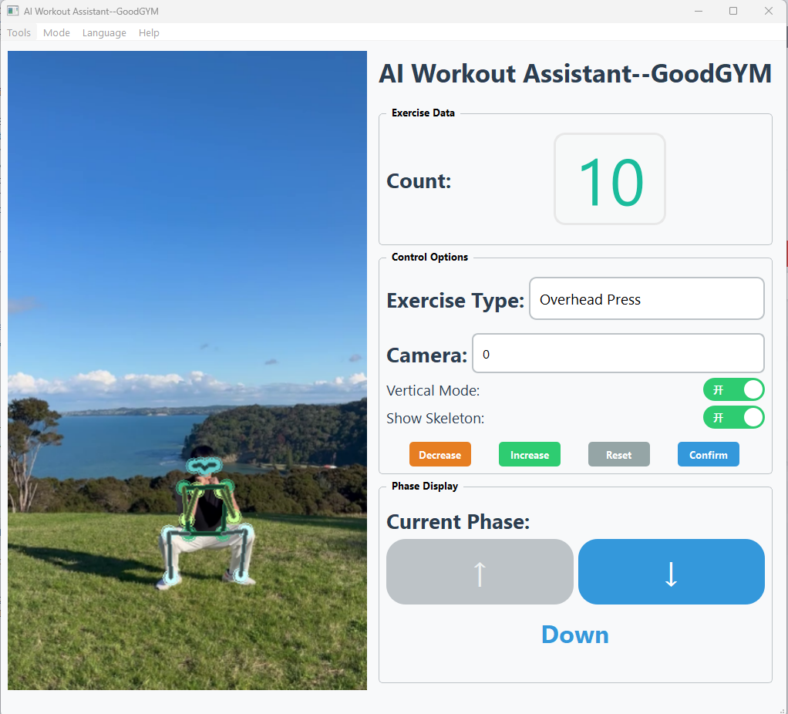

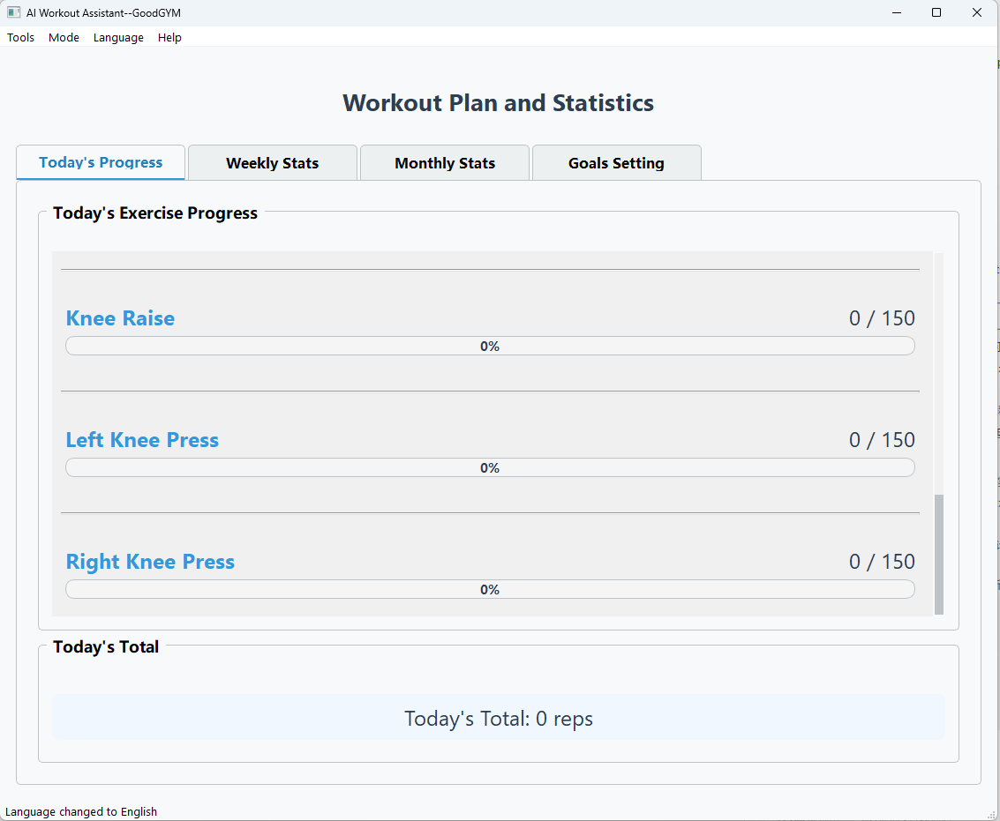

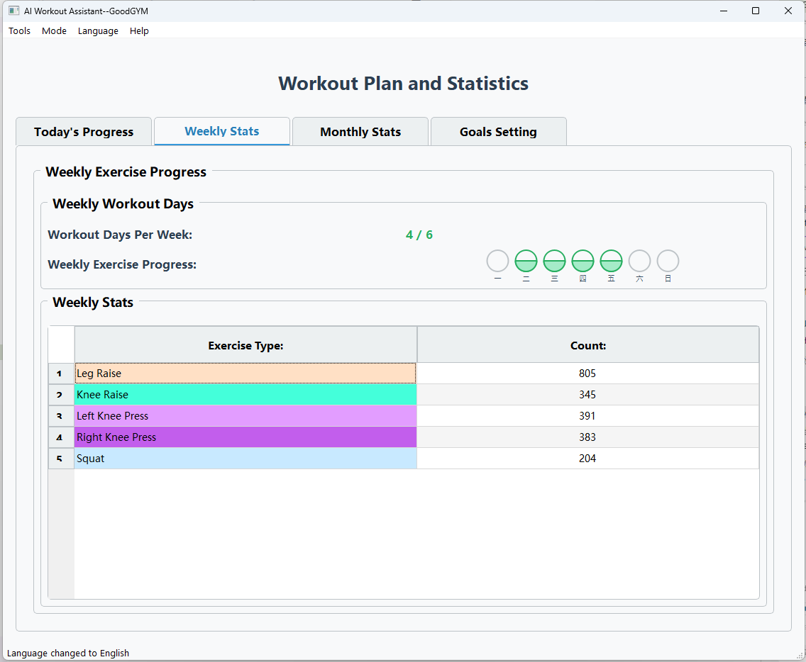

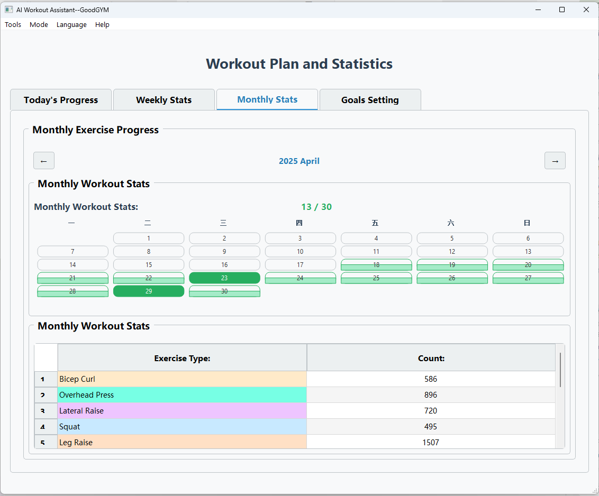

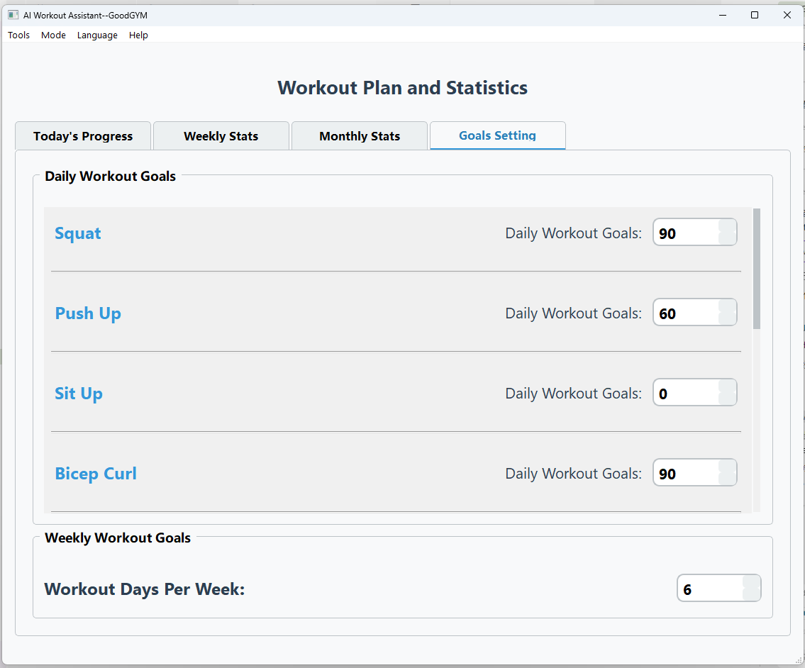

### iOS App

 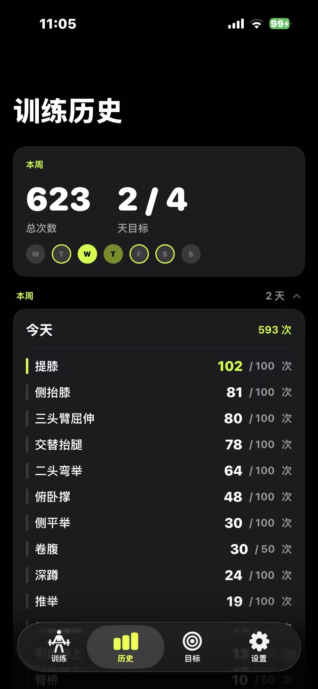 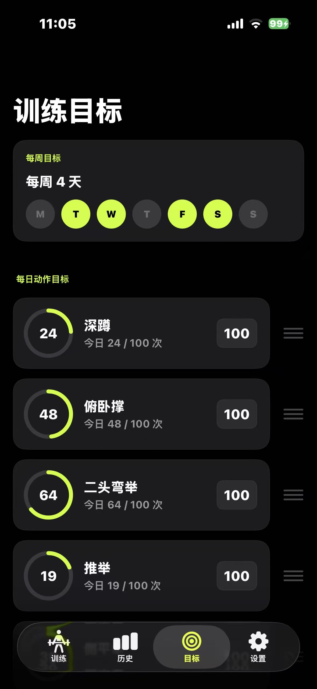 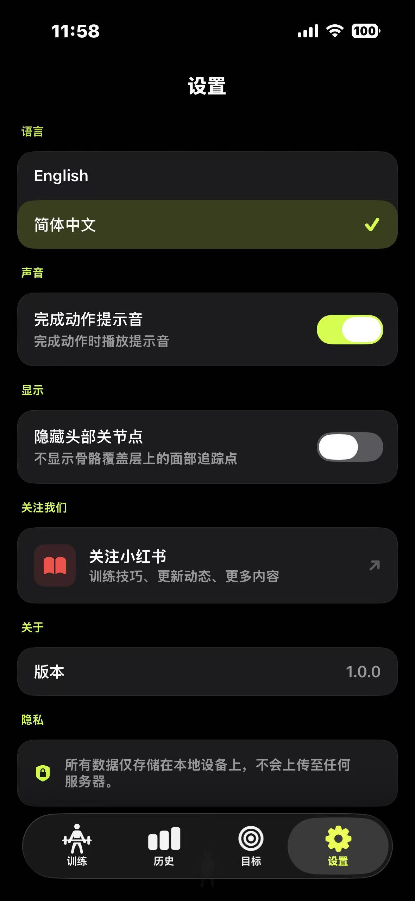 

## 🤝 Contributing

Contributions are welcome! Please feel free to submit a Pull Request.

Thanks to RTMPose open source pose detection model: https://github.com/Tau-J/rtmlib

## 📄 License

This project is licensed under the MIT License - see the LICENSE file for details.

## ⭐ Star History

[](https://star-history.com/#yo-WASSUP/Good-GYM&Date)

