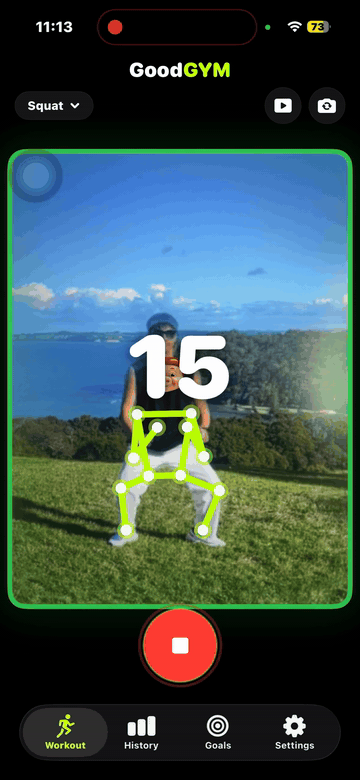
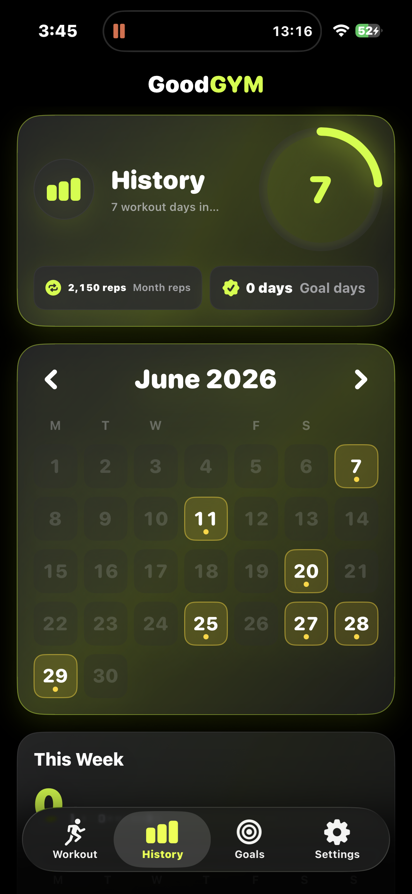
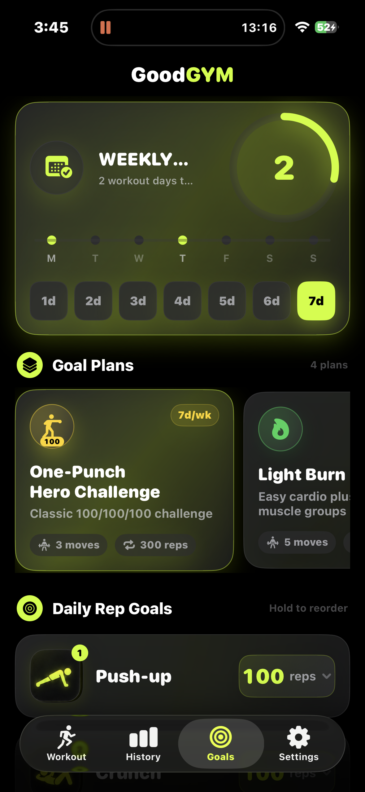
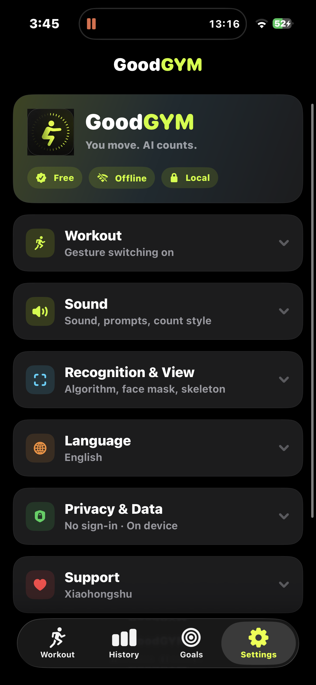

# Good-GYM: AI Fitness Assistant 💪

<div align="center">


[](https://github.com/yo-WASSUP/Good-GYM/stargazers)
[](https://github.com/yo-WASSUP/Good-GYM/network/members)
[](https://github.com/yo-WASSUP/Good-GYM/blob/main/LICENSE)

**AI Fitness Assistant**

[](https://apps.apple.com/cn/app/goodgym/id6761142874?l=en-GB)

[English](README.md) | [中文](README_CN.md)

[](
https://www.xiaohongshu.com/explore/69a3fc8f000000001a01d824?xsec_token=ABhBaGBXZRds0UaBSmH1YsFBMWMX1h0DqzL4nRfvpZMm8=&xsec_source=pc_user)

</div>

---

<div align="center">

### 📱 Download Good-GYM for iOS







[](https://apps.apple.com/cn/app/goodgym/id6761142874?l=en-GB)

</div>

## 🆕 Changelog

- **2025-06-07**: Major update! Dropped YOLO models and all GPU support. Good-GYM now uses RTMPose only for pose detection, supports CPU runtime, and is more compatible and easier to use.
- **2025-06-12**: Optimized `exercise_counters.py`, improved counting accuracy, and cleaned up the code structure.
- **2025-11-14**: Reverted to synchronous pose detection due to accuracy issues with asynchronous pose detection. Fixed a crash when switching from the statistics view back to the detection view.
- **2025-11-15**: Added the exercise type database. All exercise configurations are now managed in `data/exercises.json`, so custom exercise types can be added or edited without changing code.
- **2026-03-04**: Added optional GPU acceleration support for NVIDIA GPUs.
- **2026-03-28**: Added mobile support. The iOS app is now available.
- **2026-06-29**: Optimized the desktop UI and video streaming logic.
- **2026-07-02**: Added `build_portable.ps1` for reproducible Windows portable builds.

## 📦 Release

- **2026-07-02**: Published the Windows portable executable package `Good-GYM-Portable.zip` on [GitHub Releases](https://github.com/yo-WASSUP/Good-GYM/releases/latest).

## 🔮 Future Development

- [x] Multi-language interface
- [x] Improve pose detection accuracy
- [x] Add support for more exercise types
- [x] Add custom exercise templates
- [x] Recognize motion accuracy
- [x] Mobile app support
- [ ] Motion correction prompts
- [ ] Add voice interaction control

---

 

## ✨ Features

- **Real-time exercise counting** - Automatically counts your workout repetitions
- **Multiple exercise support** - Includes squats, push-ups, sit-ups, dumbbell movements, and many more
- **Advanced pose detection** - Uses RTMPose for accurate tracking
- **CPU recommended** - CPU inference is the default; this RTMPose real-time webcam pipeline is small, so GPU acceleration may be slower
- **Visual feedback** - Real-time skeleton visualization and angle measurement
- **Workout statistics** - Track your fitness progress
- **User-friendly interface** - Clean PyQt5 interface with intuitive controls
- **Works with standard webcams** - No special hardware required
- **Runs locally** - Full privacy

## 📋 Requirements

- Python 3.9
- Webcam
- **Windows/Mac/Linux**: Runs on CPU by default. Optional GPU acceleration is available when running from source, but CPU is generally recommended.

## 📦 Quick Download

### 📱 iOS App

- We recommend the app because using a phone is more convenient. The mobile version has more features, voice prompts, and a more user-friendly interface.

  [](https://apps.apple.com/cn/app/goodgym/id6761142874?l=en-GB)

### 💻 Windows Desktop

- If you do not want to configure a Python environment, download the pre-packaged executable from [GitHub Releases](https://github.com/yo-WASSUP/Good-GYM/releases/latest).

## 🚀 Installation Guide

### Installation

1. **Clone and install**
   ```bash
   git clone https://github.com/yo-WASSUP/Good-GYM.git
   cd Good-GYM

   # Create a virtual environment
   python -m venv venv
   # Activate on Windows
   .\venv\Scripts\activate
   # Or on Mac/Linux
   source venv/bin/activate

   # Install dependencies
   pip install -r requirements.txt
   ```

2. **Run the application**
   ```bash
   python run.py
   ```

### GPU Acceleration (Optional)

GPU is generally not recommended. The RTMPose model in this project is small, and real-time webcam usage also includes image capture, resizing, skeleton drawing, and UI refresh. CUDA data transfer and scheduling overhead may make GPU inference slower than CPU inference. GPU mode is mainly useful for your own testing and comparison.

**Prerequisites**: NVIDIA GPU + NVIDIA driver installed

**Resource usage**:
- CUDA runtime packages require about **3 GB** of disk space
- Model inference only needs about **500 MB** of VRAM, so any NVIDIA GPU with 2GB+ VRAM can run it

```bash
# 1. Replace onnxruntime with the GPU version
pip uninstall onnxruntime
pip install onnxruntime-gpu

# 2. Install CUDA runtime libraries through pip (no manual CUDA Toolkit install required)
pip install nvidia-cudnn-cu12 nvidia-cublas-cu12 nvidia-cuda-runtime-cu12 nvidia-cufft-cu12 nvidia-curand-cu12 nvidia-cusolver-cu12 nvidia-cusparse-cu12 nvidia-cuda-nvrtc-cu12
```

The application uses CPU by default. When CUDA is detected, the "GPU Acceleration" switch in the control panel becomes available, but it is not enabled automatically.

> **Note**: The packaged EXE version only supports CPU mode. GPU acceleration is only available when running from source.

## 📝 Usage Guide

### 🎯 Custom Exercise Types

All exercise types are stored in `data/exercises.json`. You can easily add, edit, or remove exercise types without changing code.

#### How to Add a New Exercise Type

1. **Keypoint index reference**
   - The system uses the COCO 17 keypoint format:
     ```
                    ○ 0
                   /|\
            1 ●     |     ● 2
           3 ●      |      ● 4
                    |
          5 ●———————————● 6
            |       |       |
            |       |       |
          7 ●       |       ● 8
            |       |       |
            |       |       |
          9 ●       |       ● 10
                    |
         11 ●———————————● 12
            |               |
            |               |
         13 ●               ● 14
            |               |
            |               |
         15 ●               ● 16

      Index │ Keypoint    Index │ Keypoint
      ──────┼──────────  ──────┼──────────
        0   │ Nose          9  │ L.Wrist
        1   │ L.Eye        10  │ R.Wrist
        2   │ R.Eye        11  │ L.Hip
        3   │ L.Ear        12  │ R.Hip
        4   │ R.Ear        13  │ L.Knee
        5   │ L.Shoulder   14  │ R.Knee
        6   │ R.Shoulder   15  │ L.Ankle
        7   │ L.Elbow      16  │ R.Ankle
        8   │ R.Elbow
     ```

2. **Configuration parameters**
   - `down_angle`: Angle threshold when lowering (degrees)
   - `up_angle`: Angle threshold when raising (degrees)
   - `keypoints.left`: Three left-side keypoint indices [pt1, pt2, pt3] used to calculate angles
   - `keypoints.right`: Three right-side keypoint indices [pt1, pt2, pt3] used to calculate angles
   - `is_leg_exercise`: Whether this is a leg exercise (true/false), which affects counting logic
   - `angle_point`: Keypoint indices [pt1, pt2, pt3] used to draw angle lines on the video

3. **Example: add a new exercise**
   ```json
   "my_custom_exercise": {
     "name_zh": "我的自定义运动",
     "name_en": "My Custom Exercise",
     "down_angle": 120,
     "up_angle": 170,
     "keypoints": {
       "left": [5, 7, 9],
       "right": [6, 8, 10]
     },
     "is_leg_exercise": false,
     "angle_point": [6, 8, 10]
   }
   ```

4. **Restart the application**
   - Save the file and restart the application to see the new exercise type.

## 🤝 Contributing

Contributions are welcome. Feel free to submit a Pull Request.

Thanks to the RTMPose open-source pose detection model: https://github.com/Tau-J/rtmlib

## 📄 License

This project is licensed under the MIT License. See the LICENSE file for details.

## ⭐ Star History

[](https://star-history.dera.page/#yo-WASSUP/Good-GYM&type=date)
