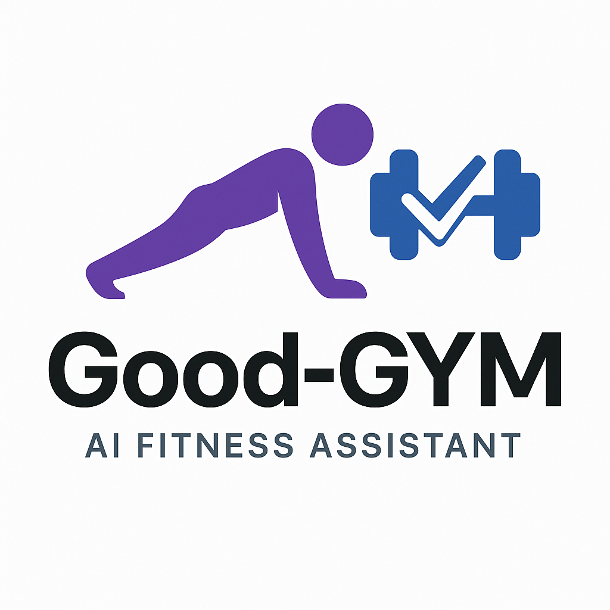

# Good-GYM: AI-Powered Workout Assistant 💪

<div align="center">



[](https://github.com/yo-WASSUP/Good-GYM/stargazers)
[](https://github.com/yo-WASSUP/Good-GYM/network/members)
[](https://github.com/yo-WASSUP/Good-GYM/blob/main/LICENSE)

**Intelligent Fitness Assistant Based on YOLOv11 Pose Detection**

[English](README.md) | [中文](README_CN.md)

[](https://www.linkedin.com/posts/huihuang-tang_ai-computervision-opencv-activity-7325469166591770624-Bbyx?utm_source=share&utm_medium=member_desktop&rcm=ACoAAD7qaoMBbw89mcxb0dNh_O4ezc8EFShoOtU)

</div>

---


## 🌟 Features

- **Real-time Exercise Counting** - Automatically counts your repetitions
- **Multiple Exercise Support** - Including squats, push-ups, sit-ups, bicep curls, and many more
- **Advanced Pose Detection** - Powered by YOLOv11 for accurate tracking
- **Model Switching** - Easily switch between small (faster) and large (more accurate) YOLOv11 models
- **Visual Feedback** - Live skeleton visualization with angle measurements
- **Workout Statistics** - Track your progress over time
- **User-friendly Interface** - Clean PyQt5 GUI with intuitive controls
- **Works with any webcam** - No special hardware required
- **Runs locally** - Complete privacy

## 📦 Direct Download
- If you don't want to set up a Python environment, you can download our pre-packaged executable:

  **Windows EXE package**: [Baidu Netdisk Link](https://pan.baidu.com/s/168Z64JX4iFoIEZom7h8cnA?pwd=8866) code: 8866
  
  **Note**: Windows version requires an NVIDIA GPU and proper drivers to run

## 📝 Usage Guide

### Controls

- Use the interface buttons to select different exercises
- Switch between models using the model selector:
  - **Small Model (Faster)**: Uses yolo11n-pose.pt for faster performance on lower-end hardware
  - **Large Model (More Accurate)**: Uses yolo11s-pose.pt for more accurate pose detection
- Real-time feedback shows your current form and repetition count
- Press the "Reset" button to reset the counter
- Use manual adjustment buttons to correct the count if needed
- Toggle skeleton visualization on/off
- View your workout statistics over time

## 🖼️ Screenshots


## 📋 Requirements

- Python 3.7+
- Webcam
- **Windows**: NVIDIA GPU required (minimum 4GB VRAM), CPU mode not supported
- **Mac/Linux**: Can run on CPU mode, but at slower speed

## 🚀 Environment Setup

### Windows GPU Installation (Required)

1. **Ensure your system meets requirements**
   - NVIDIA GPU card (4GB+ VRAM recommended)
   - Latest NVIDIA drivers installed

2. **Install CUDA and cuDNN**
   - Download and install [CUDA Toolkit](https://developer.nvidia.com/cuda-downloads) (version 11.8 recommended)
   - Download and install [cuDNN](https://developer.nvidia.com/cudnn)

3. **Clone and install**
   ```bash
   git clone https://github.com/yo-WASSUP/Good-GYM.git
   cd Good-GYM
   
   # Create virtual environment
   python -m venv venv
   # Windows activation
   .\venv\Scripts\activate
   
   # Install PyTorch with GPU support
   pip install torch torchvision --index-url https://download.pytorch.org/whl/cu118
   
   # Install other dependencies
   pip install -r requirements.txt
   ```

4. **Verify GPU availability**
   ```bash
   python -c "import torch; print('GPU available:', torch.cuda.is_available())"
   ```

5. **Run the application**
   ```bash
   python workout_qt_modular.py
   ```

6. **Build executable (optional)**
   ```powershell
   # Build the executable
   .\build_executable.bat
   ```

### Mac Installation (CPU Version)

1. **Install dependencies**
   ```bash
   # For MacOS
   brew install python
   ```

2. **Clone and install**
   ```bash
   git clone https://github.com/yo-WASSUP/Good-GYM.git
   cd Good-GYM
   
   # Create virtual environment
   python -m venv venv
   source venv/bin/activate
   
   # Install dependencies
   pip install -r requirements.txt
   ```

3. **Run the application**
   ```bash
   python workout_qt_modular.py
   ```

## 🤝 Contributing

Contributions are welcome! Please feel free to submit a Pull Request.

## 📄 License

This project is licensed under the MIT License - see the LICENSE file for details.

## 🔮 Future Development

- [ ] Add support for more exercise types
- [ ] Improve pose detection accuracy
- [ ] Add voice feedback
- [ ] Multi-language interface
