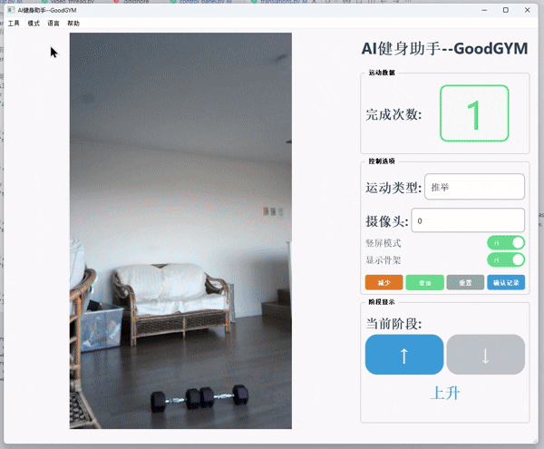

# Good-GYM: AI健身助手 💪

<div align="center">


[](https://github.com/yo-WASSUP/Good-GYM/stargazers)
[](https://github.com/yo-WASSUP/Good-GYM/network/members)
[](https://github.com/yo-WASSUP/Good-GYM/blob/main/LICENSE)

**基于RTMPose姿态检测的AI健身助手**

[English](README.md) | [中文](README_CN.md)

[](https://www.xiaohongshu.com/explore/6808b102000000001c0157ad?xsec_token=ABm-Sdk88be4nJCaCVfCI9gQahnLiKt16mUC3gbupYH3g=&xsec_source=pc_user)

</div>

## 🆕 更新日志

- **2024-06-07**：重大更新！已放弃YOLO模型和所有GPU支持，现仅采用RTMPose进行姿态检测，支持CPU运行，兼容性更好，使用更简单。

---




## ✨ 功能特点

- **实时运动计数** - 自动计算您的健身次数
- **多种运动支持** - 包括深蹲、俯卧撑、仰卧起坐、哑铃运动等十多种
- **先进的姿态检测** - 采用RTMPose实现精准跟踪
- **仅需CPU** - 无需GPU，绝大多数电脑可用
- **可视化反馈** - 实时骨骼可视化和角度测量
- **健身统计** - 跟踪您的健身进度
- **用户友好界面** - 基于PyQt5的简洁界面，操作直观
- **兼容普通摄像头** - 无需特殊硬件
- **本地运行** - 完全隐私

## 📋 系统要求

- Python 3.9
- 摄像头
- **Windows/Mac/Linux**: 仅需CPU，无需GPU。性能取决于硬件。

## 📦 快速下载

- 如果您不想配置Python环境，可以直接下载我们打包好的可执行文件：

  **Windows EXE打包版本**：

  [百度网盘链接]( https://pan.baidu.com/s/168Z64JX4iFoIEZom7h8cnA?pwd=8866) 提取码: 8866

  [Google Drive](https://drive.google.com/file/d/1KkNHAu6TAE8QzcyFxLG9K9qmzuRwHJFf/view?usp=drive_link)

  **注意**: Windows版本需要NVIDIA GPU和适当的驱动程序才能运行

## 📝 使用指南

### 控制方式

- 使用界面按钮选择不同的运动类型
- 实时反馈显示您当前的姿势和重复次数
- 按"重置"按钮重置计数器
- 使用手动调整按钮修正计数(如有需要)
- 开关骨骼可视化
- 查看您的健身统计数据

## 🚀 安装指南

### 安装方法

1. **克隆并安装**
   ```bash
   git clone https://github.com/yo-WASSUP/Good-GYM.git
   cd Good-GYM
   
   # 创建虚拟环境
   python -m venv venv
   # Windows激活
   .\venv\Scripts\activate
   # 或 (Mac/Linux)
   source venv/bin/activate
   
   # 安装依赖
   pip install -r requirements.txt
   ```

2. **运行应用**
   ```bash
   python workout_qt_modular.py
   ```

## 🖼️ 应用截图


## 🤝 贡献

欢迎贡献代码！请随时提交Pull Request。

## 📄 许可证

本项目采用MIT许可证 - 详情请参阅LICENSE文件。

## 🔮 开发计划

- [ ] 添加更多运动类型支持
- [ ] 改进姿态检测精度
- [ ] 添加语音反馈
- [ ] 移动应用支持