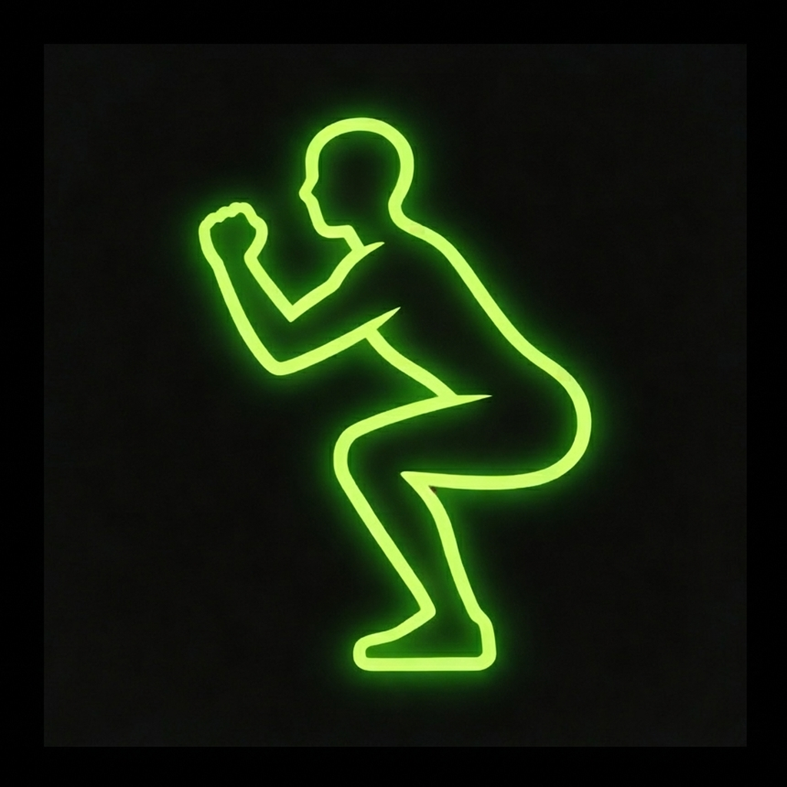
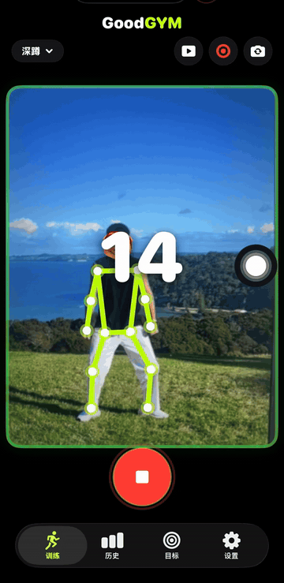
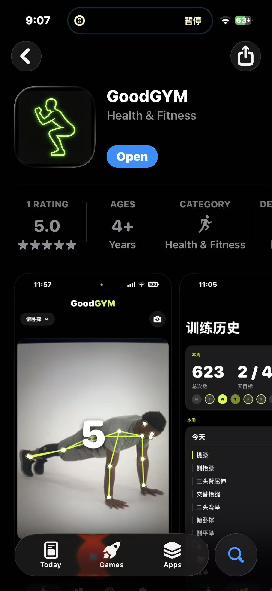
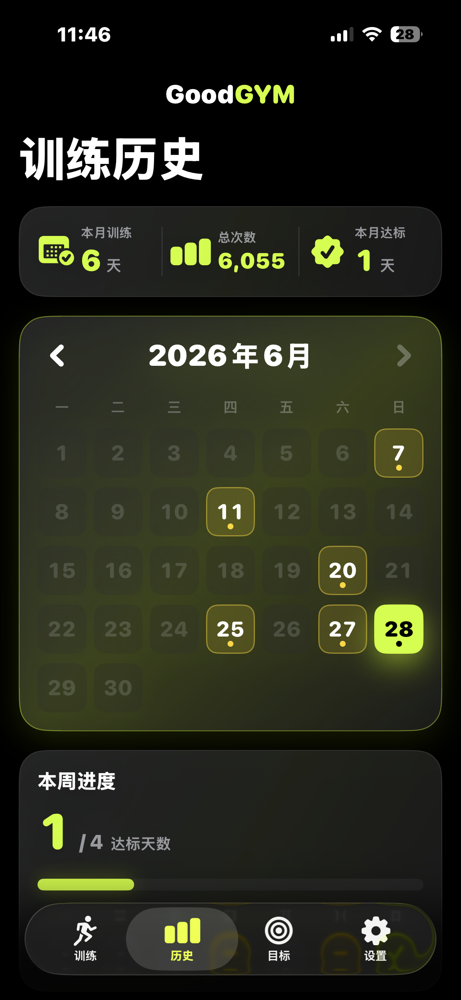
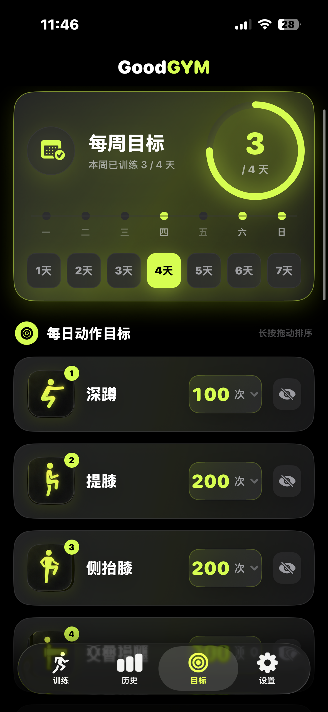
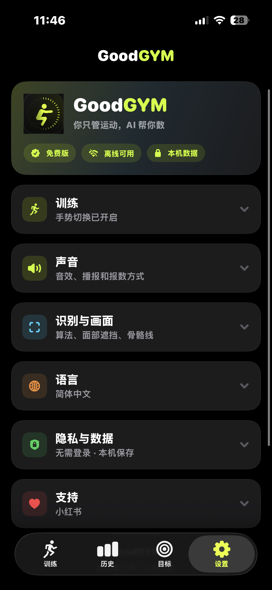
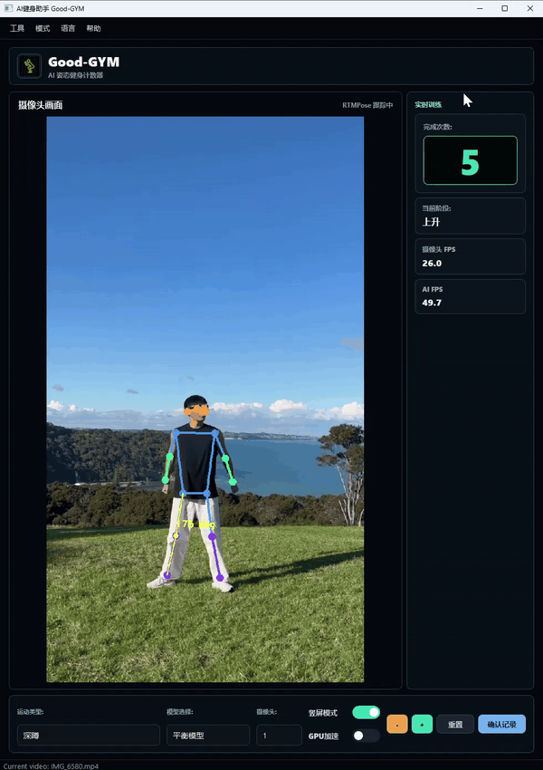
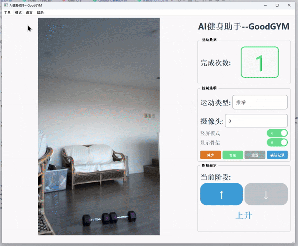

# Good-GYM: AI健身助手 💪

<div align="center">



[](https://github.com/yo-WASSUP/Good-GYM/stargazers)
[](https://github.com/yo-WASSUP/Good-GYM/network/members)
[](https://github.com/yo-WASSUP/Good-GYM/blob/main/LICENSE)

**AI健身助手**

[](https://apps.apple.com/cn/app/goodgym/id6761142874?l=en-GB)

[English](README.md) | [中文](README_CN.md)

[](
https://www.xiaohongshu.com/explore/69a3fc8f000000001a01d824?xsec_token=ABhBaGBXZRds0UaBSmH1YsFBMWMX1h0DqzL4nRfvpZMm8=&xsec_source=pc_user)

</div>
---

<div align="center">

### 📱 立即下载 GoodGYM iOS App




 
 

[](https://apps.apple.com/cn/app/goodgym/id6761142874?l=en-GB)

</div>

## 🆕 更新日志

- **2025-06-07**：重大更新！已放弃YOLO模型和所有GPU支持，现仅采用RTMPose进行姿态检测，支持CPU运行，兼容性更好，使用更简单。
- **2025-06-12**：优化exercise_counters.py，提高计数准确性，代码结构优化
- **2025-11-14**：由于异步姿态检测存在准确率问题，已恢复到同步姿态检测。修复了从统计界面切换回检测界面时闪退的问题。
- **2025-11-15**：新增运动类型数据库功能！所有运动配置现在统一管理在 `data/exercises.json` 文件中，支持自定义添加、修改运动类型，无需修改代码。
- **2026-03-04**：增加可选GPU加速功能，支持NVIDIA显卡
- **2026-03-28**：新增移动端支持，iOS App 正式上线
- **2026-06-29**：优化电脑端界面，和视频流逻辑
- **2026-07-02**：提交 `build_portable.ps1` 打包脚本，用于可复现生成 Windows 便携版。

## 📦 Release

- **2026-07-02**：发布 Windows 便携版可执行程序包 `Good-GYM-Portable.zip`，可在 [GitHub Releases](https://github.com/yo-WASSUP/Good-GYM/releases/latest) 下载。

## 🔮 开发计划

- [x] 多语言界面
- [x] 提高姿势检测精度
- [x] 添加对更多锻炼类型的支持
- [x] 添加自定义锻炼模板
- [x] 识别动作准确性
- [x] 移动应用程序支持
- [ ] 动作纠错提示
- [ ] 添加语音交互控制

---

 

## ✨ 功能特点

- **实时运动计数** - 自动计算您的健身次数
- **多种运动支持** - 包括深蹲、俯卧撑、仰卧起坐、哑铃运动等十多种
- **先进的姿态检测** - 采用RTMPose实现精准跟踪
- **CPU 推荐** - 默认使用 CPU 推理；这个 RTMPose 实时摄像头流程模型较小，GPU 加速可能更慢
- **可视化反馈** - 实时骨骼可视化和角度测量
- **健身统计** - 跟踪您的健身进度
- **用户友好界面** - 基于PyQt5的简洁界面，操作直观
- **兼容普通摄像头** - 无需特殊硬件
- **本地运行** - 完全隐私

## 📋 系统要求

- Python 3.9
- 摄像头
- **Windows/Mac/Linux**: 默认 CPU 运行；源码部署可选 GPU，但一般推荐继续使用 CPU。

## 📦 快速下载

### 📱 iOS App
- 推荐大家下载APP，因为手机更方便，手机端功能更多，有语音提示和更用户友好的界面。
  [](https://apps.apple.com/cn/app/goodgym/id6761142874?l=en-GB)

### 💻 Windows 桌面版
- 如果您不想配置Python环境，可以直接下载我们打包好的可执行文件：
   [GitHub Releases](https://github.com/yo-WASSUP/Good-GYM/releases/latest)

## 🚀 安装指南

### 安装方法

1. **克隆并安装**
   ```bash
   git clone https://github.com/yo-WASSUP/Good-GYM.git
   cd Good-GYM

   # 创建虚拟环境
   python -m venv venv
   # Windows激活
   .\venv\Scripts\activate
   # 或 (Mac/Linux)
   source venv/bin/activate

   # 安装依赖
   pip install -r requirements.txt
   ```

2. **运行应用**
   ```bash
   python run.py
   ```

### GPU加速（可选）

一般不建议开启 GPU。这个项目的 RTMPose 模型较小，实时摄像头场景里还包含图像采集、缩放、骨架绘制和 UI 刷新，CUDA 的数据传输和调度开销可能让 GPU 推理比 CPU 更慢。GPU 模式主要用于自行测试和对比。

**前提条件**：NVIDIA显卡 + 已安装NVIDIA驱动

**资源占用**：
- CUDA运行库安装包约 **3 GB** 磁盘空间
- 模型运行仅需约 **500 MB** 显存，任何 2GB 以上显存的 NVIDIA 显卡均可运行

```bash
# 1. 将onnxruntime替换为GPU版本
pip uninstall onnxruntime
pip install onnxruntime-gpu

# 2. 通过pip安装CUDA运行库（无需手动安装CUDA Toolkit）
pip install nvidia-cudnn-cu12 nvidia-cublas-cu12 nvidia-cuda-runtime-cu12 nvidia-cufft-cu12 nvidia-curand-cu12 nvidia-cusolver-cu12 nvidia-cusparse-cu12 nvidia-cuda-nvrtc-cu12
```

程序默认使用 CPU。检测到 CUDA 时，控制面板里的“GPU 加速”开关会可用，但不会自动开启。

> **注意**：打包的EXE版本仅支持CPU模式。GPU加速仅在源码部署时可用。

## 📝 使用指南

### 🎯 自定义运动类型

现在所有运动类型都存储在 `data/exercises.json` 文件中，您可以轻松添加、修改或删除运动类型，无需修改代码！

#### 如何添加新运动类型

1. **关节点索引说明**
   - 系统使用 COCO 17 关键点格式，索引对应关系：
     ```
                    ○ 0
                   /|\
            1 ●     |     ● 2
           3 ●      |      ● 4
                    |
          5 ●———————————● 6
            |       |       |
            |       |       |
          7 ●       |       ● 8
            |       |       |
            |       |       |
          9 ●       |       ● 10
                    |
         11 ●———————————● 12
            |               |
            |               |
         13 ●               ● 14
            |               |
            |               |
         15 ●               ● 16

      索引 │ 部位        索引 │ 部位
      ─────┼──────      ─────┼──────
        0  │ 鼻子         9  │ 左手腕
        1  │ 左眼        10  │ 右手腕
        2  │ 右眼        11  │ 左臀
        3  │ 左耳        12  │ 右臀
        4  │ 右耳        13  │ 左膝
        5  │ 左肩        14  │ 右膝
        6  │ 右肩        15  │ 左脚踝
        7  │ 左肘        16  │ 右脚踝
        8  │ 右肘
     ```

2. **配置参数说明**
   - `down_angle`: 动作下放时的角度阈值（度）
   - `up_angle`: 动作上升时的角度阈值（度）
   - `keypoints.left`: 左侧三个关节点索引 [点1, 点2, 点3]，用于计算角度
   - `keypoints.right`: 右侧三个关节点索引 [点1, 点2, 点3]，用于计算角度
   - `is_leg_exercise`: 是否为腿部运动（true/false），影响计数逻辑
   - `angle_point`: 用于显示的角度点索引 [点1, 点2, 点3]，在视频上绘制角度线

3. **添加新运动示例**
   ```json
   "my_custom_exercise": {
     "name_zh": "我的自定义运动",
     "name_en": "My Custom Exercise",
     "down_angle": 120,
     "up_angle": 170,
     "keypoints": {
       "left": [5, 7, 9],
       "right": [6, 8, 10]
     },
     "is_leg_exercise": false,
     "angle_point": [6, 8, 10]
   }
   ```

4. **重启程序**
   - 保存文件后，重启程序即可看到新添加的运动类型

## 🤝 贡献

欢迎贡献代码！请随时提交Pull Request。

感谢RTMPose开源姿态检测模型： https://github.com/Tau-J/rtmlib

## 📄 许可证

本项目采用MIT许可证 - 详情请参阅LICENSE文件。

## ⭐ Star History

[](https://star-history.com/#yo-WASSUP/Good-GYM&Date)
